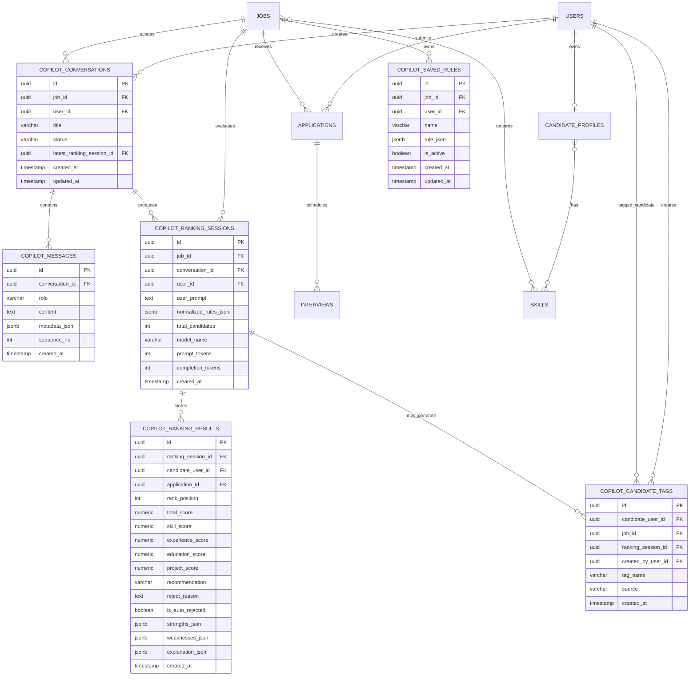

# AI Recruitment Copilot Design

## 1. Goal

AI Recruitment Copilot is a job-scoped screening assistant for HR.

It does not query PostgreSQL directly.

Backend prepares:

- Job context
- Candidate application list for a selected job
- Candidate profile and CV summary
- Existing conversation context
- Existing saved rules

AI only receives prepared payloads and returns ranking, reasons, and structured rules.

The target is a practical ATS workflow for around 1,000 applicants with low operational complexity.

## 2. Workflow Diagram

```mermaid
flowchart TD
    A[HR opens Copilot UI] --> B[Load active jobs from Backend]
    B --> C[HR selects one Job]
    C --> D[Frontend calls GET /api/copilot/jobs/{jobId}/candidates]
    D --> E[Backend loads Job + Applications + Candidate Profiles + Skills + CV Summary]
    E --> F[Frontend renders candidate pool]
    F --> G[HR enters prompt]
    G --> H[Frontend calls POST /api/copilot/conversations/{conversationId}/rankings]
    H --> I[Backend builds AI request payload]
    I --> J[AI extracts intent and rules]
    J --> K[AI scores each candidate]
    K --> L[AI marks auto-reject candidates]
    L --> M[AI returns ranked results + structured output]
    M --> N[Backend stores RankingSession + RankingResults + Messages]
    N --> O[Frontend shows ranked candidate cards]
    O --> P[HR sends follow-up prompt]
    P --> Q[Backend reuses conversation context + latest ranking]
    Q --> H
```

## 3. ERD Diagram



## 4. Detailed Schema Design

### 4.1 copilot_conversations

Purpose:

- One chat session per HR and job
- Holds the latest ranking session to support follow-up prompts

Suggested fields:

- `id uuid pk`
- `job_id uuid not null`
- `user_id uuid not null`
- `title varchar(200) null`
- `status varchar(30) not null default 'Active'`
- `latest_ranking_session_id uuid null`
- `created_at timestamp not null default now()`
- `updated_at timestamp not null default now()`

Constraints:

- FK to `jobs`
- FK to `users`

Indexes:

- `(job_id, user_id, created_at desc)`
- `(latest_ranking_session_id)`

### 4.2 copilot_messages

Purpose:

- Stores full conversation history
- Supports audit, replay, and model context reconstruction

Suggested fields:

- `id uuid pk`
- `conversation_id uuid not null`
- `role varchar(20) not null`
- `content text not null`
- `metadata_json jsonb null`
- `sequence_no int not null`
- `created_at timestamp not null default now()`

Role values:

- `User`
- `Assistant`
- `System`

Indexes:

- `(conversation_id, sequence_no)`

### 4.3 copilot_ranking_sessions

Purpose:

- One AI evaluation execution for one prompt
- Parent record for ranking results

Suggested fields:

- `id uuid pk`
- `job_id uuid not null`
- `conversation_id uuid not null`
- `user_id uuid not null`
- `user_prompt text not null`
- `normalized_rules_json jsonb not null`
- `total_candidates int not null`
- `model_name varchar(100) null`
- `prompt_tokens int null`
- `completion_tokens int null`
- `created_at timestamp not null default now()`

Important note:

- `normalized_rules_json` is the parsed AI intent:
  - required skills
  - preferred skills
  - min experience
  - auto reject rules
  - score thresholds

Indexes:

- `(conversation_id, created_at desc)`
- `(job_id, created_at desc)`

### 4.4 copilot_ranking_results

Purpose:

- Per candidate result for a ranking session
- Keeps both rank and explanation

Suggested fields:

- `id uuid pk`
- `ranking_session_id uuid not null`
- `candidate_user_id uuid not null`
- `application_id uuid not null`
- `rank_position int not null`
- `total_score numeric(5,2) not null`
- `skill_score numeric(5,2) not null`
- `experience_score numeric(5,2) not null`
- `education_score numeric(5,2) not null`
- `project_score numeric(5,2) not null`
- `recommendation varchar(30) not null`
- `reject_reason text null`
- `is_auto_rejected boolean not null default false`
- `strengths_json jsonb not null`
- `weaknesses_json jsonb not null`
- `explanation_json jsonb null`
- `created_at timestamp not null default now()`

Recommendation values:

- `Interview`
- `Consider`
- `Hold`
- `Reject`

Indexes:

- `(ranking_session_id, rank_position)`
- `(ranking_session_id, is_auto_rejected, total_score desc)`
- `(candidate_user_id, created_at desc)`

### 4.5 copilot_saved_rules

Purpose:

- Persistent HR-defined rules by job
- Can be auto-applied to future prompts

Suggested fields:

- `id uuid pk`
- `job_id uuid not null`
- `user_id uuid not null`
- `name varchar(200) not null`
- `rule_json jsonb not null`
- `is_active boolean not null default true`
- `created_at timestamp not null default now()`
- `updated_at timestamp not null default now()`

Rule JSON examples:

```json
{
  "type": "AutoReject",
  "field": "education",
  "operator": "contains",
  "value": "FPT"
}
```

```json
{
  "type": "RequireExperience",
  "minYears": 2
}
```

Indexes:

- `(job_id, is_active)`
- `(user_id, created_at desc)`

### 4.6 copilot_candidate_tags

Purpose:

- Light-weight labels created by AI or HR
- Can be used for quick filter chips in UI

Suggested fields:

- `id uuid pk`
- `candidate_user_id uuid not null`
- `job_id uuid not null`
- `ranking_session_id uuid null`
- `created_by_user_id uuid not null`
- `tag_name varchar(100) not null`
- `source varchar(20) not null`
- `created_at timestamp not null default now()`

Source values:

- `AI`
- `HR`
- `System`

Indexes:

- `(job_id, tag_name)`
- `(candidate_user_id, tag_name)`

## 5. PostgreSQL CREATE TABLE

```sql
create table copilot_conversations (
    id uuid primary key default gen_random_uuid(),
    job_id uuid not null references jobs(id) on delete cascade,
    user_id uuid not null references users(id) on delete cascade,
    title varchar(200),
    status varchar(30) not null default 'Active',
    latest_ranking_session_id uuid null,
    created_at timestamp without time zone not null default now(),
    updated_at timestamp without time zone not null default now()
);

create table copilot_messages (
    id uuid primary key default gen_random_uuid(),
    conversation_id uuid not null references copilot_conversations(id) on delete cascade,
    role varchar(20) not null,
    content text not null,
    metadata_json jsonb,
    sequence_no int not null,
    created_at timestamp without time zone not null default now(),
    constraint ck_copilot_messages_role
        check (role in ('User', 'Assistant', 'System'))
);

create table copilot_ranking_sessions (
    id uuid primary key default gen_random_uuid(),
    job_id uuid not null references jobs(id) on delete cascade,
    conversation_id uuid not null references copilot_conversations(id) on delete cascade,
    user_id uuid not null references users(id) on delete cascade,
    user_prompt text not null,
    normalized_rules_json jsonb not null,
    total_candidates int not null,
    model_name varchar(100),
    prompt_tokens int,
    completion_tokens int,
    created_at timestamp without time zone not null default now()
);

alter table copilot_conversations
    add constraint fk_copilot_conversations_latest_ranking_session
    foreign key (latest_ranking_session_id)
    references copilot_ranking_sessions(id)
    on delete set null;

create table copilot_ranking_results (
    id uuid primary key default gen_random_uuid(),
    ranking_session_id uuid not null references copilot_ranking_sessions(id) on delete cascade,
    candidate_user_id uuid not null references users(id) on delete cascade,
    application_id uuid not null references applications(id) on delete cascade,
    rank_position int not null,
    total_score numeric(5,2) not null,
    skill_score numeric(5,2) not null,
    experience_score numeric(5,2) not null,
    education_score numeric(5,2) not null,
    project_score numeric(5,2) not null,
    recommendation varchar(30) not null,
    reject_reason text,
    is_auto_rejected boolean not null default false,
    strengths_json jsonb not null,
    weaknesses_json jsonb not null,
    explanation_json jsonb,
    created_at timestamp without time zone not null default now(),
    constraint uq_copilot_ranking_results_session_candidate
        unique (ranking_session_id, candidate_user_id),
    constraint ck_copilot_ranking_results_recommendation
        check (recommendation in ('Interview', 'Consider', 'Hold', 'Reject'))
);

create table copilot_saved_rules (
    id uuid primary key default gen_random_uuid(),
    job_id uuid not null references jobs(id) on delete cascade,
    user_id uuid not null references users(id) on delete cascade,
    name varchar(200) not null,
    rule_json jsonb not null,
    is_active boolean not null default true,
    created_at timestamp without time zone not null default now(),
    updated_at timestamp without time zone not null default now()
);

create table copilot_candidate_tags (
    id uuid primary key default gen_random_uuid(),
    candidate_user_id uuid not null references users(id) on delete cascade,
    job_id uuid not null references jobs(id) on delete cascade,
    ranking_session_id uuid null references copilot_ranking_sessions(id) on delete set null,
    created_by_user_id uuid not null references users(id) on delete cascade,
    tag_name varchar(100) not null,
    source varchar(20) not null,
    created_at timestamp without time zone not null default now(),
    constraint ck_copilot_candidate_tags_source
        check (source in ('AI', 'HR', 'System'))
);

create index ix_copilot_conversations_job_user_created_at
    on copilot_conversations(job_id, user_id, created_at desc);

create index ix_copilot_messages_conversation_sequence
    on copilot_messages(conversation_id, sequence_no);

create index ix_copilot_ranking_sessions_conversation_created_at
    on copilot_ranking_sessions(conversation_id, created_at desc);

create index ix_copilot_ranking_sessions_job_created_at
    on copilot_ranking_sessions(job_id, created_at desc);

create index ix_copilot_ranking_results_session_rank
    on copilot_ranking_results(ranking_session_id, rank_position);

create index ix_copilot_ranking_results_session_reject_score
    on copilot_ranking_results(ranking_session_id, is_auto_rejected, total_score desc);

create index ix_copilot_saved_rules_job_active
    on copilot_saved_rules(job_id, is_active);

create index ix_copilot_candidate_tags_job_tag
    on copilot_candidate_tags(job_id, tag_name);
```

## 6. EF Core Entities

### 6.1 Conversation

```csharp
namespace RecruitPro.Domain.Entities;

public partial class CopilotConversation
{
    public Guid Id { get; set; }
    public Guid JobId { get; set; }
    public Guid UserId { get; set; }
    public string? Title { get; set; }
    public string Status { get; set; } = "Active";
    public Guid? LatestRankingSessionId { get; set; }
    public DateTime? CreatedAt { get; set; }
    public DateTime? UpdatedAt { get; set; }

    public virtual Job Job { get; set; } = null!;
    public virtual User User { get; set; } = null!;
    public virtual CopilotRankingSession? LatestRankingSession { get; set; }
    public virtual ICollection<CopilotMessage> Messages { get; set; } = new List<CopilotMessage>();
    public virtual ICollection<CopilotRankingSession> RankingSessions { get; set; } = new List<CopilotRankingSession>();
}
```

### 6.2 Message

```csharp
namespace RecruitPro.Domain.Entities;

public partial class CopilotMessage
{
    public Guid Id { get; set; }
    public Guid ConversationId { get; set; }
    public string Role { get; set; } = null!;
    public string Content { get; set; } = null!;
    public string? MetadataJson { get; set; }
    public int SequenceNo { get; set; }
    public DateTime? CreatedAt { get; set; }

    public virtual CopilotConversation Conversation { get; set; } = null!;
}
```

### 6.3 Ranking Session

```csharp
namespace RecruitPro.Domain.Entities;

public partial class CopilotRankingSession
{
    public Guid Id { get; set; }
    public Guid JobId { get; set; }
    public Guid ConversationId { get; set; }
    public Guid UserId { get; set; }
    public string UserPrompt { get; set; } = null!;
    public string NormalizedRulesJson { get; set; } = "{}";
    public int TotalCandidates { get; set; }
    public string? ModelName { get; set; }
    public int? PromptTokens { get; set; }
    public int? CompletionTokens { get; set; }
    public DateTime? CreatedAt { get; set; }

    public virtual Job Job { get; set; } = null!;
    public virtual User User { get; set; } = null!;
    public virtual CopilotConversation Conversation { get; set; } = null!;
    public virtual ICollection<CopilotRankingResult> Results { get; set; } = new List<CopilotRankingResult>();
}
```

### 6.4 Ranking Result

```csharp
namespace RecruitPro.Domain.Entities;

public partial class CopilotRankingResult
{
    public Guid Id { get; set; }
    public Guid RankingSessionId { get; set; }
    public Guid CandidateUserId { get; set; }
    public Guid ApplicationId { get; set; }
    public int RankPosition { get; set; }
    public decimal TotalScore { get; set; }
    public decimal SkillScore { get; set; }
    public decimal ExperienceScore { get; set; }
    public decimal EducationScore { get; set; }
    public decimal ProjectScore { get; set; }
    public string Recommendation { get; set; } = null!;
    public string? RejectReason { get; set; }
    public bool IsAutoRejected { get; set; }
    public string StrengthsJson { get; set; } = "[]";
    public string WeaknessesJson { get; set; } = "[]";
    public string? ExplanationJson { get; set; }
    public DateTime? CreatedAt { get; set; }

    public virtual CopilotRankingSession RankingSession { get; set; } = null!;
    public virtual User CandidateUser { get; set; } = null!;
    public virtual Application Application { get; set; } = null!;
}
```

### 6.5 Saved Rule

```csharp
namespace RecruitPro.Domain.Entities;

public partial class CopilotSavedRule
{
    public Guid Id { get; set; }
    public Guid JobId { get; set; }
    public Guid UserId { get; set; }
    public string Name { get; set; } = null!;
    public string RuleJson { get; set; } = "{}";
    public bool IsActive { get; set; }
    public DateTime? CreatedAt { get; set; }
    public DateTime? UpdatedAt { get; set; }

    public virtual Job Job { get; set; } = null!;
    public virtual User User { get; set; } = null!;
}
```

### 6.6 Candidate Tag

```csharp
namespace RecruitPro.Domain.Entities;

public partial class CopilotCandidateTag
{
    public Guid Id { get; set; }
    public Guid CandidateUserId { get; set; }
    public Guid JobId { get; set; }
    public Guid? RankingSessionId { get; set; }
    public Guid CreatedByUserId { get; set; }
    public string TagName { get; set; } = null!;
    public string Source { get; set; } = "AI";
    public DateTime? CreatedAt { get; set; }

    public virtual User CandidateUser { get; set; } = null!;
    public virtual Job Job { get; set; } = null!;
    public virtual CopilotRankingSession? RankingSession { get; set; }
    public virtual User CreatedByUser { get; set; } = null!;
}
```

## 7. EF Core Configurations

Add to `AppDbContext` as standard fluent mappings.

### 7.1 DbSet

```csharp
public virtual DbSet<CopilotConversation> CopilotConversations { get; set; }
public virtual DbSet<CopilotMessage> CopilotMessages { get; set; }
public virtual DbSet<CopilotRankingSession> CopilotRankingSessions { get; set; }
public virtual DbSet<CopilotRankingResult> CopilotRankingResults { get; set; }
public virtual DbSet<CopilotSavedRule> CopilotSavedRules { get; set; }
public virtual DbSet<CopilotCandidateTag> CopilotCandidateTags { get; set; }
```

### 7.2 Fluent Mapping Sketch

```csharp
modelBuilder.Entity<CopilotConversation>(entity =>
{
    entity.ToTable("copilot_conversations");
    entity.HasKey(e => e.Id);

    entity.Property(e => e.Id).HasDefaultValueSql("gen_random_uuid()").HasColumnName("id");
    entity.Property(e => e.JobId).HasColumnName("job_id");
    entity.Property(e => e.UserId).HasColumnName("user_id");
    entity.Property(e => e.Title).HasMaxLength(200).HasColumnName("title");
    entity.Property(e => e.Status).HasMaxLength(30).HasColumnName("status");
    entity.Property(e => e.LatestRankingSessionId).HasColumnName("latest_ranking_session_id");
    entity.Property(e => e.CreatedAt).HasDefaultValueSql("now()").HasColumnName("created_at");
    entity.Property(e => e.UpdatedAt).HasDefaultValueSql("now()").HasColumnName("updated_at");

    entity.HasOne(e => e.Job).WithMany().HasForeignKey(e => e.JobId);
    entity.HasOne(e => e.User).WithMany().HasForeignKey(e => e.UserId);
    entity.HasOne(e => e.LatestRankingSession).WithMany().HasForeignKey(e => e.LatestRankingSessionId);
});

modelBuilder.Entity<CopilotMessage>(entity =>
{
    entity.ToTable("copilot_messages");
    entity.HasKey(e => e.Id);

    entity.Property(e => e.Id).HasDefaultValueSql("gen_random_uuid()").HasColumnName("id");
    entity.Property(e => e.ConversationId).HasColumnName("conversation_id");
    entity.Property(e => e.Role).HasMaxLength(20).HasColumnName("role");
    entity.Property(e => e.Content).HasColumnName("content");
    entity.Property(e => e.MetadataJson).HasColumnName("metadata_json");
    entity.Property(e => e.SequenceNo).HasColumnName("sequence_no");
    entity.Property(e => e.CreatedAt).HasDefaultValueSql("now()").HasColumnName("created_at");

    entity.HasIndex(e => new { e.ConversationId, e.SequenceNo });
    entity.HasOne(e => e.Conversation).WithMany(e => e.Messages).HasForeignKey(e => e.ConversationId);
});

modelBuilder.Entity<CopilotRankingSession>(entity =>
{
    entity.ToTable("copilot_ranking_sessions");
    entity.HasKey(e => e.Id);

    entity.Property(e => e.Id).HasDefaultValueSql("gen_random_uuid()").HasColumnName("id");
    entity.Property(e => e.JobId).HasColumnName("job_id");
    entity.Property(e => e.ConversationId).HasColumnName("conversation_id");
    entity.Property(e => e.UserId).HasColumnName("user_id");
    entity.Property(e => e.UserPrompt).HasColumnName("user_prompt");
    entity.Property(e => e.NormalizedRulesJson).HasColumnName("normalized_rules_json");
    entity.Property(e => e.TotalCandidates).HasColumnName("total_candidates");
    entity.Property(e => e.ModelName).HasMaxLength(100).HasColumnName("model_name");
    entity.Property(e => e.PromptTokens).HasColumnName("prompt_tokens");
    entity.Property(e => e.CompletionTokens).HasColumnName("completion_tokens");
    entity.Property(e => e.CreatedAt).HasDefaultValueSql("now()").HasColumnName("created_at");

    entity.HasOne(e => e.Job).WithMany().HasForeignKey(e => e.JobId);
    entity.HasOne(e => e.User).WithMany().HasForeignKey(e => e.UserId);
    entity.HasOne(e => e.Conversation).WithMany(e => e.RankingSessions).HasForeignKey(e => e.ConversationId);
});

modelBuilder.Entity<CopilotRankingResult>(entity =>
{
    entity.ToTable("copilot_ranking_results");
    entity.HasKey(e => e.Id);

    entity.Property(e => e.Id).HasDefaultValueSql("gen_random_uuid()").HasColumnName("id");
    entity.Property(e => e.RankingSessionId).HasColumnName("ranking_session_id");
    entity.Property(e => e.CandidateUserId).HasColumnName("candidate_user_id");
    entity.Property(e => e.ApplicationId).HasColumnName("application_id");
    entity.Property(e => e.RankPosition).HasColumnName("rank_position");
    entity.Property(e => e.TotalScore).HasPrecision(5, 2).HasColumnName("total_score");
    entity.Property(e => e.SkillScore).HasPrecision(5, 2).HasColumnName("skill_score");
    entity.Property(e => e.ExperienceScore).HasPrecision(5, 2).HasColumnName("experience_score");
    entity.Property(e => e.EducationScore).HasPrecision(5, 2).HasColumnName("education_score");
    entity.Property(e => e.ProjectScore).HasPrecision(5, 2).HasColumnName("project_score");
    entity.Property(e => e.Recommendation).HasMaxLength(30).HasColumnName("recommendation");
    entity.Property(e => e.RejectReason).HasColumnName("reject_reason");
    entity.Property(e => e.IsAutoRejected).HasColumnName("is_auto_rejected");
    entity.Property(e => e.StrengthsJson).HasColumnName("strengths_json");
    entity.Property(e => e.WeaknessesJson).HasColumnName("weaknesses_json");
    entity.Property(e => e.ExplanationJson).HasColumnName("explanation_json");
    entity.Property(e => e.CreatedAt).HasDefaultValueSql("now()").HasColumnName("created_at");

    entity.HasIndex(e => new { e.RankingSessionId, e.RankPosition });
    entity.HasIndex(e => new { e.RankingSessionId, e.IsAutoRejected, e.TotalScore });
    entity.HasOne(e => e.RankingSession).WithMany(e => e.Results).HasForeignKey(e => e.RankingSessionId);
    entity.HasOne(e => e.CandidateUser).WithMany().HasForeignKey(e => e.CandidateUserId);
    entity.HasOne(e => e.Application).WithMany().HasForeignKey(e => e.ApplicationId);
});
```

## 8. Clean Architecture Folder Structure

Recommended additions:

```text
RecruitPro.Domain
  Entities
    CopilotConversation.cs
    CopilotMessage.cs
    CopilotRankingSession.cs
    CopilotRankingResult.cs
    CopilotSavedRule.cs
    CopilotCandidateTag.cs

RecruitPro.Application
  DTOs
    Request
      Copilot
        CreateConversationRequest.cs
        CopilotPromptRequest.cs
        SaveCopilotRuleRequest.cs
    Response
      Copilot
        CopilotConversationDto.cs
        CopilotMessageDto.cs
        CopilotCandidatePoolDto.cs
        CopilotRankingSessionDto.cs
        CopilotRankingResultDto.cs
        CopilotRuleDto.cs
        CopilotPromptResponseDto.cs
        AiCopilotRequestDto.cs
        AiCopilotResponseDto.cs
  Interfaces
    IRepositories
      ICopilotConversationRepository.cs
      ICopilotMessageRepository.cs
      ICopilotRankingSessionRepository.cs
      ICopilotSavedRuleRepository.cs
      ICopilotCandidateTagRepository.cs
    IServices
      ICopilotService.cs
      IAiCopilotProvider.cs
  Services
    CopilotService.cs
    AiCopilotOrchestrator.cs
  Mappings
    CopilotProfile.cs

RecruitPro.Infrastructure
  Repositories
    CopilotConversationRepository.cs
    CopilotMessageRepository.cs
    CopilotRankingSessionRepository.cs
    CopilotSavedRuleRepository.cs
    CopilotCandidateTagRepository.cs
  Service
    OpenAiCopilotProvider.cs

RecruitPro.API
  Controllers
    CopilotController.cs
```

## 9. API Design

Base route:

- `/api/copilot`

### 9.1 Load jobs for selector

```http
GET /api/copilot/jobs
```

Response:

```json
[
  {
    "jobId": "30000000-0000-4000-8000-000000000010",
    "title": "Backend Developer Intern",
    "status": "APPROVED",
    "applicationCount": 53
  }
]
```

### 9.2 Create or resume conversation by job

```http
POST /api/copilot/conversations
```

Request:

```json
{
  "jobId": "30000000-0000-4000-8000-000000000010"
}
```

Response:

```json
{
  "conversationId": "8d2f2f3e-11b1-4a1e-a8c8-b23f8d8bb101",
  "jobId": "30000000-0000-4000-8000-000000000010",
  "title": "Backend Developer Intern Copilot",
  "latestRankingSessionId": null
}
```

### 9.3 Load candidate pool for selected job

```http
GET /api/copilot/jobs/{jobId}/candidates
```

Response:

```json
{
  "job": {
    "jobId": "30000000-0000-4000-8000-000000000010",
    "title": "Backend Developer Intern",
    "description": "Build internal APIs ...",
    "requirements": [
      "Java",
      "Spring Boot"
    ]
  },
  "candidates": [
    {
      "candidateUserId": "20000000-0000-4000-8000-000000000101",
      "applicationId": "50000000-0000-4000-8000-000000000101",
      "fullName": "Nguyen Van A",
      "education": "HCMUT",
      "experienceYears": 2,
      "skills": ["Java", "Spring Boot", "Docker"],
      "cvSummary": "Backend candidate with API and PostgreSQL experience",
      "resumeUrl": "https://..."
    }
  ]
}
```

### 9.4 Submit copilot prompt

```http
POST /api/copilot/conversations/{conversationId}/rankings
```

Request:

```json
{
  "jobId": "30000000-0000-4000-8000-000000000010",
  "prompt": "Tim ung vien biet Java Spring Boot va uu tien tren 2 nam kinh nghiem",
  "useLatestRankingContext": true
}
```

Response:

```json
{
  "conversationId": "8d2f2f3e-11b1-4a1e-a8c8-b23f8d8bb101",
  "rankingSessionId": "9e7a2df1-2f0d-4c6c-a6d7-8cb87211d111",
  "normalizedRules": {
    "requiredSkills": ["Java", "Spring Boot"],
    "preferredSkills": [],
    "minExperienceYears": 2,
    "autoRejectRules": []
  },
  "results": [
    {
      "candidateUserId": "20000000-0000-4000-8000-000000000101",
      "applicationId": "50000000-0000-4000-8000-000000000101",
      "rankPosition": 1,
      "totalScore": 92,
      "skillScore": 40,
      "experienceScore": 28,
      "educationScore": 16,
      "projectScore": 8,
      "recommendation": "Interview",
      "isAutoRejected": false,
      "rejectReason": null,
      "strengths": ["Java", "Spring Boot", "Docker"],
      "weaknesses": ["No AWS"],
      "summary": "Strong backend match for this role."
    }
  ]
}
```

### 9.5 Load conversation history

```http
GET /api/copilot/conversations/{conversationId}
```

### 9.6 Load ranking session detail

```http
GET /api/copilot/ranking-sessions/{rankingSessionId}
```

### 9.7 Save rule

```http
POST /api/copilot/jobs/{jobId}/rules
```

### 9.8 List saved rules

```http
GET /api/copilot/jobs/{jobId}/rules
```

### 9.9 Toggle active rule

```http
PATCH /api/copilot/rules/{ruleId}
```

### 9.10 Tag candidate

```http
POST /api/copilot/candidates/{candidateUserId}/tags
```

## 10. AI Request Contract

Backend sends exactly one prepared payload.

```json
{
  "conversationId": "8d2f2f3e-11b1-4a1e-a8c8-b23f8d8bb101",
  "job": {
    "jobId": "30000000-0000-4000-8000-000000000010",
    "title": "Backend Developer Intern",
    "description": "Build internal APIs with ASP.NET Core and PostgreSQL",
    "requirements": [
      "Java",
      "Spring Boot",
      "PostgreSQL"
    ],
    "preferredSkills": [
      "Docker",
      "Redis"
    ]
  },
  "savedRules": [
    {
      "name": "Reject FPT",
      "rule": {
        "type": "AutoReject",
        "field": "education",
        "operator": "contains",
        "value": "FPT"
      }
    }
  ],
  "previousRankingContext": {
    "rankingSessionId": "old-session-id",
    "topCandidates": [
      {
        "candidateUserId": "20000000-0000-4000-8000-000000000101",
        "totalScore": 92
      }
    ]
  },
  "userPrompt": "Tim nguoi biet Java Spring Boot va loai sinh vien FPT",
  "candidates": [
    {
      "candidateUserId": "20000000-0000-4000-8000-000000000101",
      "applicationId": "50000000-0000-4000-8000-000000000101",
      "fullName": "Nguyen Van A",
      "education": "HCMUT",
      "experienceYears": 2,
      "skills": ["Java", "Spring Boot", "Docker"],
      "cvSummary": "Backend intern with Spring Boot and SQL projects",
      "projects": [
        "E-commerce API",
        "Recruitment dashboard"
      ],
      "resumeText": "optional extracted resume text"
    }
  ]
}
```

## 11. AI Response Contract

```json
{
  "normalizedRules": {
    "requiredSkills": ["Java", "Spring Boot"],
    "preferredSkills": [],
    "minExperienceYears": 0,
    "autoRejectRules": [
      {
        "field": "education",
        "operator": "contains",
        "value": "FPT",
        "reason": "FPT Student"
      }
    ],
    "minTotalScore": null
  },
  "results": [
    {
      "candidateUserId": "20000000-0000-4000-8000-000000000101",
      "applicationId": "50000000-0000-4000-8000-000000000101",
      "rankPosition": 1,
      "totalScore": 92,
      "skillScore": 40,
      "experienceScore": 30,
      "educationScore": 14,
      "projectScore": 8,
      "recommendation": "Interview",
      "isAutoRejected": false,
      "rejectReason": null,
      "strengths": ["Java", "Spring Boot", "Docker"],
      "weaknesses": ["No Redis"],
      "summary": "Very strong skills match for backend internship."
    },
    {
      "candidateUserId": "20000000-0000-4000-8000-000000000102",
      "applicationId": "50000000-0000-4000-8000-000000000102",
      "rankPosition": 15,
      "totalScore": 35,
      "skillScore": 10,
      "experienceScore": 10,
      "educationScore": 10,
      "projectScore": 5,
      "recommendation": "Reject",
      "isAutoRejected": true,
      "rejectReason": "FPT Student",
      "strengths": ["Communication"],
      "weaknesses": ["No Java", "No Spring Boot"],
      "summary": "Rejected by explicit user rule."
    }
  ]
}
```

## 12. Recommended Backend Orchestration

### Step A - Build candidate pool from existing ATS tables

Use:

- `jobs`
- `applications`
- `users`
- `candidate_profiles`
- `candidate_skills`
- `skills`

Optional:

- resume text extracted from file and cached in a new table later

### Step B - Normalize prompt

Use AI first to extract structured rules.

Why:

- Keeps screening deterministic
- Easier to save rule history
- Easier to debug why a candidate was rejected

### Step C - Score candidates

Prefer a hybrid approach:

1. Rule parsing by AI
2. Primary deterministic scoring in backend
3. AI only generates human-readable explanation and recommendation text

This is the most important architecture recommendation.

For 1,000 candidates, full free-form LLM scoring per candidate is expensive and slow.

Better design:

- Backend computes:
  - skill score
  - experience score
  - education flags
  - auto reject rules
- AI adds:
  - strengths
  - weaknesses
  - summary sentence
  - natural-language recommendation

### Step D - Persist ranking session

Store:

- original user prompt
- normalized rules
- result list
- AI token usage

### Step E - Reuse latest ranking context

For follow-up prompts:

- load latest ranking session
- send only:
  - previous normalized rules
  - previous top candidates
  - previous rejected candidates
  - current prompt

This avoids re-reading the database every turn.

## 13. Scoring Formula Recommendation

Suggested weighted formula:

```text
TotalScore = SkillScore + ExperienceScore + EducationScore + ProjectScore

SkillScore      max 40
ExperienceScore max 30
EducationScore  max 20
ProjectScore    max 10
```

Suggested deterministic rules:

- `SkillScore`
  - required skills matched / total required skills * 40
- `ExperienceScore`
  - proportional to `candidate.experience_years` capped at requested min/max
- `EducationScore`
  - positive if education matches preferred profile
  - zero if neutral
  - can trigger auto reject if explicit rule exists
- `ProjectScore`
  - derived from keyword overlap between CV summary and job description

Auto reject logic must run before final ranking.

Sorting:

1. `is_auto_rejected asc`
2. `total_score desc`
3. `skill_score desc`
4. `experience_score desc`

## 14. Performance Recommendation For 1,000 Candidates

For around 1,000 applicants per job:

- Good enough with PostgreSQL + ASP.NET Core + one ranking session at a time
- No need for event streaming or microservices

Recommended practical architecture:

### Keep synchronous for first version

- One API request creates one ranking session
- Backend loads candidate pool in one query set
- Backend computes deterministic scores in memory
- AI summarizes only top N and rejected edge cases if cost must be reduced

### Add caching

Cache per `jobId` candidate pool snapshot for 3 to 10 minutes:

- Job info
- Candidate summaries
- Skills
- Extracted CV text snippet

### Add resume text extraction cache

If CV files are PDF:

- Extract text once when candidate uploads resume
- Save to optional future table `candidate_resume_snapshots`

This avoids OCR or PDF parsing during ranking.

### Batch AI usage

Do not ask LLM 1,000 times.

Instead:

- deterministic ranking for all candidates
- LLM explanation only for:
  - top 20
  - auto rejected candidates shown in page
  - candidates manually opened by HR

That gives much better latency and cost.

### Pagination

Frontend should page ranked results:

- top 20 by default
- filters for `AutoRejected`, `Interview`, `Hold`

## 15. Final Recommendation

For this ATS, the optimal design is:

1. Job-scoped conversation
2. Backend-prepared candidate pool
3. AI parses prompt into structured rules
4. Backend performs main scoring and auto-reject deterministically
5. AI adds explanations and conversational refinement
6. Persist every ranking session for audit and follow-up prompts

This architecture is simpler, cheaper, easier to debug, and strong enough for around 1,000 applicants.
