# RecruitPro — Entity Relationship Diagram (ERD)

> Sinh từ schema thật trong [`init.sql`](../../init.sql) và đối chiếu với cấu hình Fluent API trong
> `RecruitPro.Infrastructure/Data/AppDbContext.cs`. Tổng **34 bảng**. PK/FK và bội số quan hệ thể hiện
> trực tiếp trên sơ đồ Mermaid bên dưới (xem được trên GitHub, VS Code, hoặc dán vào <https://mermaid.live>).

## Cách đọc
- `||--o{` = một-nhiều (một bên trái ↔ nhiều bên phải).
- `||--o|` = một-một (0..1).
- `PK` = khóa chính, `FK` = khóa ngoại, `NN` = NOT NULL.
- Bảng nối có thuộc tính: `user_roles`, `role_permissions`, `candidate_skills`, `job_skills`,
  `application_offer_benefits`.
- Workflow trạng thái nằm ở cột `status` của `applications`, `jobs`, `interviews`, `application_offers`.

```mermaid
erDiagram
    users ||--o{ user_roles : "assigned"
    roles ||--o{ user_roles : "assigned"
    roles ||--o{ role_permissions : "grants"
    permissions ||--o{ role_permissions : "in"
    users ||--o| candidate_profiles : "has"
    users ||--o{ departments : "heads"
    users ||--o{ jobs : "creates"
    users ||--o{ jobs : "approves"
    users ||--o{ jobs : "recruits"
    departments ||--o{ jobs : "owns"
    skills ||--o{ candidate_skills : "in"
    candidate_profiles ||--o{ candidate_skills : "has"
    skills ||--o{ job_skills : "in"
    jobs ||--o{ job_skills : "requires"
    users ||--o{ applications : "applies"
    jobs ||--o{ applications : "receives"
    users ||--o{ applications : "reviews"
    users ||--o{ applications : "recruiter_of"
    users ||--o{ applications : "depthead_of"
    applications ||--o{ interviews : "schedules"
    users ||--o{ notifications : "receives"
    users ||--o{ refresh_tokens : "owns"
    users ||--o{ system_logs : "logs"
    applications ||--o| application_offers : "has"
    offer_templates ||--o{ application_offers : "based_on"
    offer_currencies ||--o{ application_offers : "priced_in"
    users ||--o{ application_offers : "manages"
    application_offers ||--o{ application_offer_benefits : "includes"
    offer_benefits ||--o{ application_offer_benefits : "listed_in"
    candidate_profiles ||--o{ candidate_resumes : "has"
    candidate_profiles ||--o{ candidate_projects : "has"
    candidate_profiles ||--o{ candidate_profile_sections : "has"
    candidate_profile_sections ||--o{ candidate_profile_section_items : "has"
    jobs ||--o{ copilot_conversations : "about"
    users ||--o{ copilot_conversations : "owns"
    copilot_ranking_sessions ||--o{ copilot_conversations : "latest_of"
    copilot_conversations ||--o{ copilot_messages : "contains"
    jobs ||--o{ copilot_ranking_sessions : "for"
    copilot_conversations ||--o{ copilot_ranking_sessions : "in"
    users ||--o{ copilot_ranking_sessions : "runs"
    copilot_ranking_sessions ||--o{ copilot_ranking_results : "produces"
    users ||--o{ copilot_ranking_results : "candidate"
    applications ||--o{ copilot_ranking_results : "scores"
    jobs ||--o{ copilot_saved_rules : "for"
    users ||--o{ copilot_saved_rules : "owns"
    users ||--o{ copilot_candidate_tags : "tagged"
    jobs ||--o{ copilot_candidate_tags : "for"
    copilot_ranking_sessions ||--o{ copilot_candidate_tags : "from"
    users ||--o{ copilot_candidate_tags : "created_by"
    users ||--o{ copilot_prompt_templates : "owns"
    jobs ||--o{ candidate_fit_analyses : "for"
    users ||--o{ candidate_fit_analyses : "candidate"
    applications ||--o{ candidate_fit_analyses : "analyzes"
    users ||--o{ copilot_generated_artifacts : "owns"
    jobs ||--o{ copilot_generated_artifacts : "for"
    applications ||--o{ copilot_generated_artifacts : "for"

    users {
        uuid id PK
        varchar username "NN, unique"
        varchar email "NN, unique"
        text password_hash "NN"
        varchar full_name "NN"
        varchar phone
        text avatar_url
        varchar status
        int token_version "NN, default 0"
        timestamp created_at
        timestamp updated_at
    }
    roles {
        uuid id PK
        varchar name "NN, unique"
        text description
    }
    permissions {
        uuid id PK
        varchar name "NN"
        varchar code "NN, unique"
        text description
    }
    user_roles {
        uuid user_id PK,FK
        uuid role_id PK,FK
        timestamp assigned_at "NN"
    }
    role_permissions {
        uuid role_id PK,FK
        uuid permission_id PK,FK
        timestamptz assigned_at "NN"
    }
    departments {
        uuid id PK
        varchar name "NN, unique"
        text description
        uuid head_user_id FK
    }
    candidate_profiles {
        uuid id PK
        uuid user_id FK "NN, unique"
        varchar current_position
        integer experience_years
        text education
        text address
        text bio
        text resume_url
        text github_url
        text linkedin_url
        jsonb parsed_resume_json
        text resume_extracted_text
        varchar resume_parse_status
        text resume_parse_error
        varchar resume_parse_model
        jsonb resume_parser_warnings_json
        timestamp resume_parsed_at
        jsonb candidate_embedding_vector
        varchar candidate_embedding_text_hash
        varchar candidate_embedding_status
        text candidate_embedding_error
        timestamp candidate_embedding_updated_at
        text experience_entries_json
        text education_records_json
        text certification_records_json
        text language_records_json
    }
    skills {
        uuid id PK
        varchar name "NN, unique"
    }
    candidate_skills {
        uuid candidate_id PK,FK
        uuid skill_id PK,FK
        numeric years_of_experience
    }
    jobs {
        uuid id PK
        uuid department_id FK
        uuid created_by FK "NN"
        uuid approved_by FK
        uuid recruiter_id FK
        varchar title "NN"
        varchar short_pitch
        text description "NN"
        text requirements
        text benefits
        varchar location "NN"
        varchar work_mode "NN"
        varchar employment_type "NN"
        integer min_experience_years
        integer vacancy_count
        numeric salary_min
        numeric salary_max
        timestamp deadline
        varchar status
        timestamp created_at
        jsonb job_embedding_vector
        varchar job_embedding_text_hash
        varchar job_embedding_status
        text job_embedding_error
        timestamp job_embedding_updated_at
    }
    job_skills {
        uuid job_id PK,FK
        uuid skill_id PK,FK
        numeric min_years_experience
        boolean is_required "NN"
    }
    applications {
        uuid id PK
        uuid user_id FK "NN"
        uuid job_id FK "NN"
        uuid reviewed_by FK
        uuid assigned_recruiter_id FK
        uuid assigned_department_head_id FK
        varchar status
        timestamp applied_at
        text cover_letter
        numeric rule_score
        numeric semantic_score
        numeric final_score
        varchar score_status
        text score_error
        timestamp scored_at
        timestamp department_head_review_requested_at
    }
    interviews {
        uuid id PK
        uuid application_id FK "NN"
        timestamp interview_date "NN"
        varchar meeting_type
        text meeting_link
        text location
        text notes
        varchar status
    }
    notifications {
        uuid id PK
        uuid user_id FK "NN"
        varchar title
        text body
        text content
        varchar event_code
        jsonb data_json
        varchar entity_type
        uuid entity_id
        varchar type
        boolean is_read
        timestamp read_at
        boolean is_seen
        timestamp seen_at
        timestamp created_at
    }
    refresh_tokens {
        uuid id PK
        uuid user_id FK "NN"
        text token "NN, SHA-256 hash"
        timestamp expiry_date "NN"
    }
    system_logs {
        uuid id PK
        uuid user_id FK
        varchar action
        text description
        timestamp created_at
    }
    offer_templates {
        uuid id PK
        varchar name "NN"
        text description
        text template_body "NN"
        boolean is_active "NN"
        integer display_order "NN"
    }
    offer_benefits {
        uuid id PK
        varchar name "NN"
        text description
        boolean is_active "NN"
        integer display_order "NN"
    }
    offer_currencies {
        varchar code PK
        varchar name "NN"
        varchar symbol "NN"
        boolean is_active "NN"
        integer display_order "NN"
    }
    application_offers {
        uuid id PK
        uuid application_id FK "NN, unique"
        uuid offer_template_id FK
        numeric base_salary "NN"
        varchar currency_code FK "NN"
        text bonus_description
        text equity_notes
        varchar employment_type "NN"
        timestamp proposed_start_date
        varchar probation_period
        uuid reporting_manager_id FK
        text personal_message
        varchar status "NN"
        timestamp sent_at
        timestamp created_at
        timestamp updated_at
    }
    application_offer_benefits {
        uuid offer_id PK,FK
        uuid benefit_id PK,FK
    }
    candidate_resumes {
        uuid id PK
        uuid candidate_profile_id FK "NN"
        text storage_key "NN"
        varchar file_name "NN"
        integer version "NN"
        timestamp upload_date "NN"
        boolean is_current "NN"
    }
    candidate_projects {
        uuid id PK
        uuid candidate_profile_id FK "NN"
        varchar name "NN"
        varchar role
        text description
        text technologies_json
        integer start_month "NN"
        integer start_year "NN"
        integer end_month
        integer end_year
        boolean is_current "NN"
    }
    candidate_profile_sections {
        uuid id PK
        uuid candidate_profile_id FK "NN"
        varchar section_key
        varchar title "NN"
        varchar section_type "NN"
        varchar source "NN"
        integer display_order "NN"
        text schema_json
        timestamp created_at "NN"
        timestamp updated_at "NN"
    }
    candidate_profile_section_items {
        uuid id PK
        uuid section_id FK "NN"
        varchar item_type "NN"
        varchar title "NN"
        varchar subtitle
        varchar organization
        varchar location
        text description
        varchar date_label
        integer start_month
        integer start_year
        integer end_month
        integer end_year
        boolean is_current "NN"
        integer display_order "NN"
        text tags_json
        text attributes_json
        timestamp created_at "NN"
        timestamp updated_at "NN"
    }
    copilot_conversations {
        uuid id PK
        uuid job_id FK "NN"
        uuid user_id FK "NN"
        varchar title
        varchar status "NN"
        uuid latest_ranking_session_id FK
        timestamp created_at "NN"
        timestamp updated_at "NN"
    }
    copilot_messages {
        uuid id PK
        uuid conversation_id FK "NN"
        varchar role "NN"
        text content "NN"
        jsonb metadata_json
        integer sequence_no "NN"
        timestamp created_at "NN"
    }
    copilot_ranking_sessions {
        uuid id PK
        uuid job_id FK "NN"
        uuid conversation_id FK "NN"
        uuid user_id FK "NN"
        text user_prompt "NN"
        jsonb normalized_rules_json "NN"
        varchar input_hash
        integer total_candidates "NN"
        varchar model_name
        integer prompt_tokens
        integer completion_tokens
        timestamp created_at "NN"
    }
    copilot_ranking_results {
        uuid id PK
        uuid ranking_session_id FK "NN"
        uuid candidate_user_id FK "NN"
        uuid application_id FK "NN"
        integer rank_position "NN"
        numeric total_score "NN"
        numeric skill_score "NN"
        numeric experience_score "NN"
        numeric education_score "NN"
        numeric project_score "NN"
        varchar recommendation "NN"
        text reject_reason
        boolean is_auto_rejected "NN"
        jsonb strengths_json "NN"
        jsonb weaknesses_json "NN"
        jsonb explanation_json
        timestamp created_at "NN"
    }
    copilot_saved_rules {
        uuid id PK
        uuid job_id FK "NN"
        uuid user_id FK "NN"
        varchar name "NN"
        jsonb rule_json "NN"
        boolean is_active "NN"
        boolean is_deleted "NN"
        timestamp created_at "NN"
        timestamp updated_at "NN"
        timestamp deleted_at
    }
    copilot_candidate_tags {
        uuid id PK
        uuid candidate_user_id FK "NN"
        uuid job_id FK "NN"
        uuid ranking_session_id FK
        uuid created_by_user_id FK "NN"
        varchar tag_name "NN"
        varchar source "NN"
        timestamp created_at "NN"
    }
    copilot_prompt_templates {
        uuid id PK
        uuid owner_user_id FK "NN"
        varchar name "NN"
        varchar template_type "NN"
        text prompt "NN"
        boolean is_active "NN"
        timestamp created_at "NN"
        timestamp updated_at "NN"
    }
    candidate_fit_analyses {
        uuid id PK
        uuid audit_id "NN"
        uuid job_id FK "NN"
        uuid candidate_user_id FK "NN"
        uuid application_id FK "NN"
        varchar fit_label "NN"
        numeric confidence_score "NN"
        numeric total_score "NN"
        jsonb strengths_json "NN"
        jsonb gaps_json "NN"
        jsonb evidence_json "NN"
        text summary "NN"
        varchar provider_name "NN"
        varchar model_name "NN"
        boolean fallback_used "NN"
        timestamp created_at "NN"
    }
    copilot_generated_artifacts {
        uuid id PK
        uuid owner_user_id FK "NN"
        uuid job_id FK
        uuid application_id FK
        varchar artifact_type "NN"
        text prompt "NN"
        jsonb payload_json "NN"
        varchar provider_name "NN"
        varchar model_name "NN"
        boolean fallback_used "NN"
        timestamp created_at "NN"
    }
```

## Nhóm bảng theo miền
- **Danh tính & phân quyền:** `users`, `roles`, `permissions`, `user_roles`, `role_permissions`,
  `refresh_tokens` (lưu hash SHA-256 của refresh token), `system_logs`.
  `users.token_version` là "thế hệ" token — vô hiệu hóa tài khoản sẽ +1 để hủy mọi access token đang sống.
- **Tuyển dụng cốt lõi:** `departments`, `jobs`, `skills`, `job_skills`, `applications`, `interviews`,
  `candidate_profiles`, `candidate_skills`, `candidate_resumes`, `candidate_projects`,
  `candidate_profile_sections`, `candidate_profile_section_items`.
- **Offer:** `offer_templates`, `offer_benefits`, `offer_currencies`, `application_offers`,
  `application_offer_benefits`.
- **AI Copilot / xếp hạng CV:** `copilot_conversations`, `copilot_messages`, `copilot_ranking_sessions`,
  `copilot_ranking_results`, `copilot_saved_rules`, `copilot_candidate_tags`, `copilot_prompt_templates`,
  `candidate_fit_analyses`, `copilot_generated_artifacts`.
- **Thông báo:** `notifications`.
