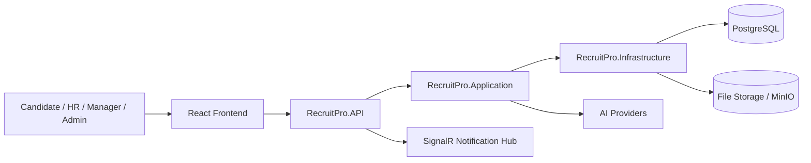

# 01. System Overview

## Purpose

RecruitPro is a recruitment / ATS platform for:

- Candidate self-service registration, profile management, resume upload, and job application
- Internal recruiting operations for HR, Manager, and SystemAdmin roles
- AI-assisted resume parsing, semantic matching, recommendation, and copilot ranking

## Main Users

- Candidate
- HR
- Manager
- SystemAdmin

## Core Flows

- Candidate registers and manages profile
- Candidate uploads resume and applies for jobs
- HR creates and manages jobs
- HR reviews applications, schedules interviews, and sends offers
- AI generates structured resume data, embeddings, scoring, and ranking support

## Tech Stack

- Backend: ASP.NET Core
- Architecture: Clean Architecture style
- ORM: Entity Framework Core
- Database: PostgreSQL
- Authentication: JWT
- File storage: MinIO-based file service
- Realtime: SignalR notification hub
- Frontend: React + TypeScript + Vite

## Solution Structure

- `RecruitPro.API`
- `RecruitPro.Application`
- `RecruitPro.Infrastructure`
- `RecruitPro.Domain`
- `RecruitPro.Tests`
- `recruit-pro-fe`

## Folder Structure Notes

The codebase contains:

- Backend source and tests in `recruit-pro/`
- Frontend source in `recruit-pro-fe/recruit-pro-fe/`
- Documentation in `recruit-pro/docs/`
- AI and process notes already present in `recruit-pro/docs/`

## High-Level Architecture

## Current System Characteristics

- Candidate profile is treated as the normalized source of truth after resume parsing
- AI is used as an augmentation layer, not as a mandatory dependency for business flow
- Internal and candidate flows are separated by role-based and permission-based access

