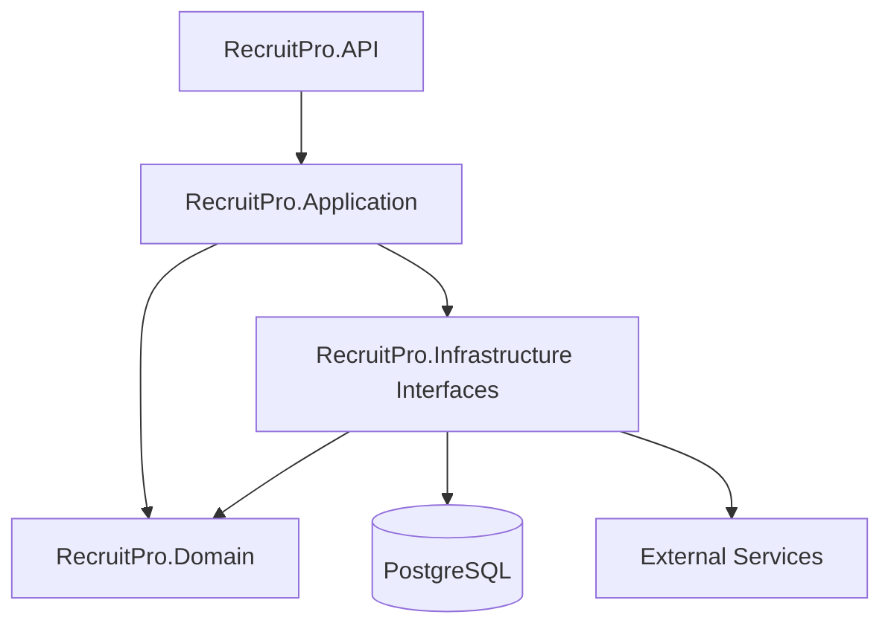
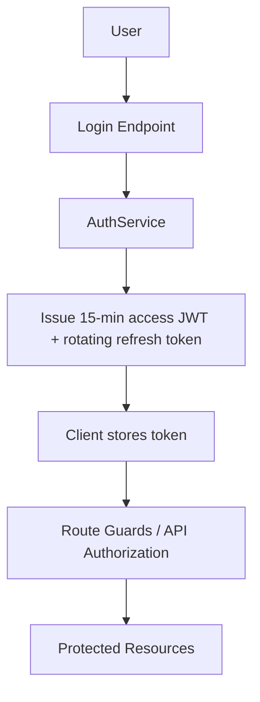
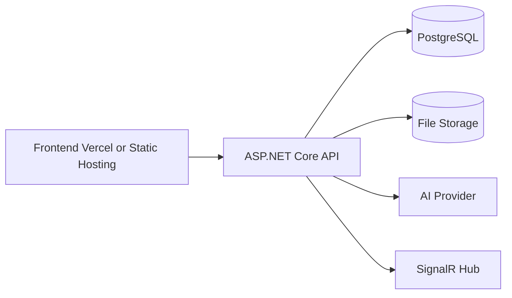

# 02. Architecture

## Architectural Style

RecruitPro follows a layered Clean Architecture style:

- API layer for transport and authentication boundaries
- Application layer for orchestration and business use cases
- Infrastructure layer for persistence and external integrations
- Domain layer for entities and business primitives

## Layer Dependencies

## Internal Communication

- Controllers call application services
- Application services call repositories and infrastructure abstractions
- Infrastructure implements repository and service interfaces

## External Integrations

- PostgreSQL
- MinIO/file storage
- Email delivery service
- AI-compatible provider endpoints
- SignalR for realtime notifications

## Background Workers

- `SemanticScoringBackgroundService` in the API project
- In-memory application semantic processing queue

## Event Flow

The system uses an async enrichment pattern:

1. Core business transaction is saved first
2. Background or deferred AI/semantic work runs afterward
3. Failure in enrichment should not block the main business flow

## Authentication Flow

## Deployment Architecture

## Known Architectural Properties

- Business flow remains usable if AI fails
- Embedding refresh occurs after data changes
- Candidate profile model supports both legacy and flexible section-based data

