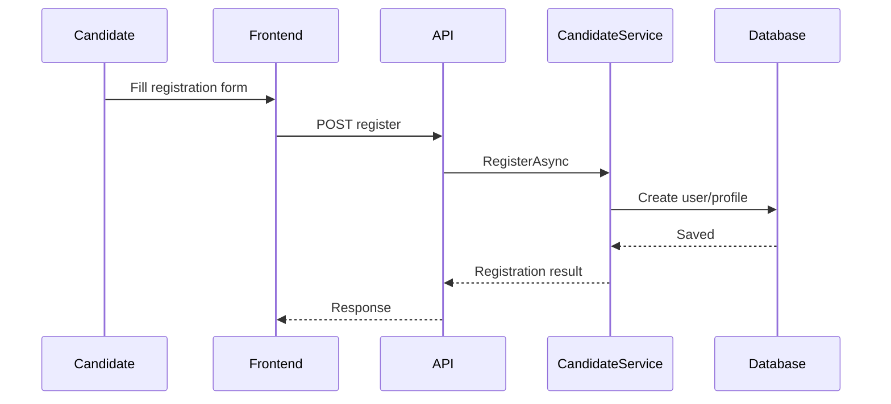
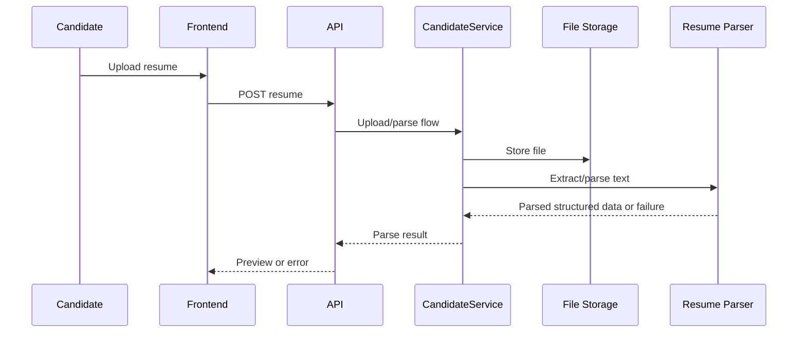
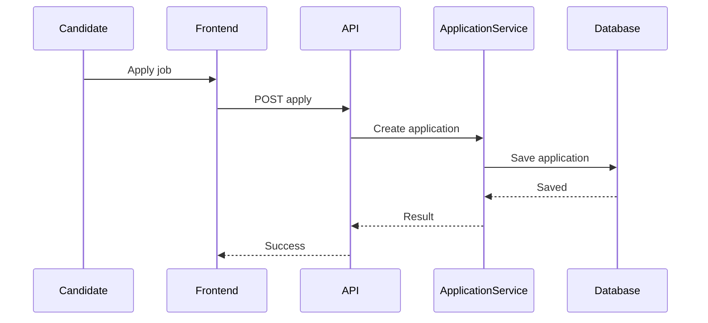
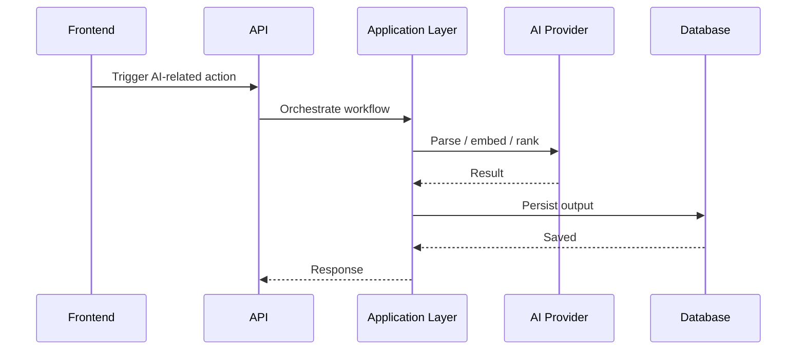

# 06. Workflows

## Candidate Registration

## Resume Upload

## Job Application

## Application Review

- HR opens application list
- HR reviews candidate profile and CV
- HR changes status or sends email
- System records the action and may trigger notification

## Interview Process

- HR schedules interview from application
- Interview status updates follow the workflow
- Interview data appears in dashboard and list screens

## Offer Process

- HR creates or sends offer
- Candidate can accept offer where allowed
- Offer records are linked to application workflow

## Notification Flow

- A business action creates notification record
- SignalR hub can push realtime updates
- Candidate or internal user sees notification list/count

## Current AI Flow

